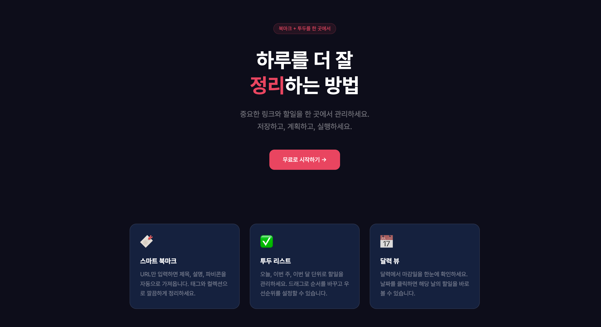
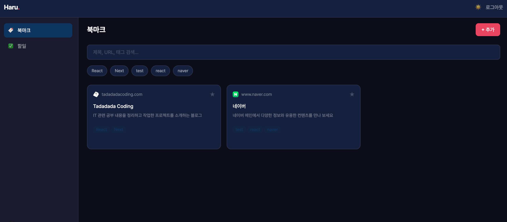
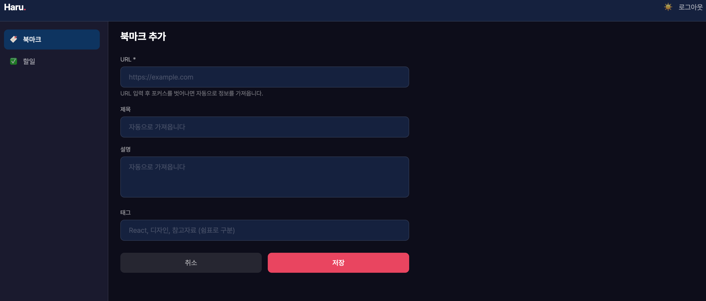
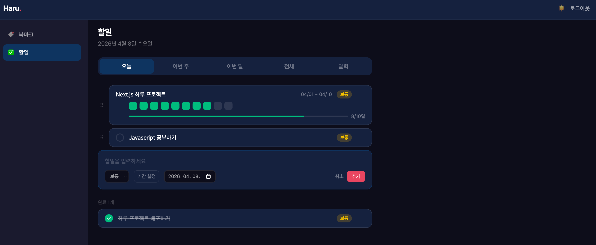
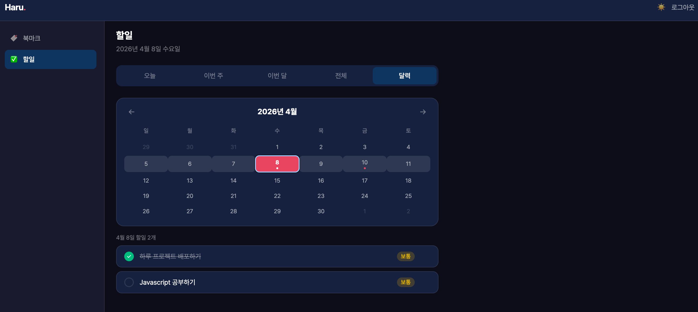

# Haru.

> 북마크와 투두를 한 곳에서 관리하는 웹 애플리케이션

[](https://haru-lac.vercel.app)
[](https://nextjs.org)
[](https://www.typescriptlang.org)
[](https://supabase.com)

🔗 **[https://haru-lac.vercel.app](https://haru-lac.vercel.app)**

---

## 📸 스크린샷

### 랜딩 페이지


### 북마크 목록


### 북마크 추가


### 투두 리스트


### 달력 뷰


---

## ✨ 주요 기능

### 🔖 북마크
- URL 입력 시 제목·설명·파비콘 자동 수집
- 태그 기반 분류 및 필터링
- 제목·URL·태그 통합 검색
- 즐겨찾기 등록

### ✅ 투두 리스트
- 오늘·이번 주·이번 달·전체 탭 분류
- 드래그 앤 드롭으로 순서 변경 (dnd-kit)
- 우선순위 설정 (높음·보통·낮음)
- 기간 투두 — 날짜 그리드로 일별 체크

### 📅 달력 뷰
- 월별 달력에서 마감일 한눈에 확인
- 날짜 클릭 시 해당 날 투두 표시
- 이전·다음 달 이동

### 🔐 인증
- Supabase Auth 이메일 로그인·회원가입
- 로그인 후 데이터 클라우드 자동 동기화

### 🎨 테마
- 다크·라이트 모드 지원
- 토글 버튼으로 즉시 전환

---

## 🛠 기술 스택

| 구분 | 기술 |
|---|---|
| 프레임워크 | Next.js 15 (App Router) |
| 언어 | TypeScript |
| 스타일링 | Tailwind CSS v4 |
| 서버 상태 관리 | TanStack Query |
| 백엔드·DB | Supabase (PostgreSQL + Auth) |
| 드래그 앤 드롭 | dnd-kit |
| 날짜 처리 | date-fns |
| 폰트 | Pretendard |
| 배포 | Vercel |

---

## 🗂 프로젝트 구조

```
src/
├── app/
│   ├── (app)/              # 인증 필요 페이지
│   │   ├── bookmarks/      # 북마크 목록·추가
│   │   └── todos/          # 투두 리스트
│   ├── (auth)/             # 인증 페이지
│   │   └── auth/login/
│   ├── api/
│   │   └── bookmarks/meta/ # URL 메타데이터 스크래핑
│   └── page.tsx            # 랜딩 페이지
├── components/
│   ├── bookmark/           # 북마크 관련 컴포넌트
│   ├── todo/               # 투두 관련 컴포넌트
│   └── layout/             # 레이아웃 컴포넌트
├── hooks/                  # TanStack Query 커스텀 훅
├── lib/                    # Supabase 클라이언트, 유틸
├── providers/              # Context Providers
└── types/                  # TypeScript 타입 정의
```

---

## 🚀 로컬 실행

```bash
# 의존성 설치
pnpm install

# 환경변수 설정
# .env.local 파일 생성 후 아래 값 입력
NEXT_PUBLIC_SUPABASE_URL=your_supabase_url
NEXT_PUBLIC_SUPABASE_ANON_KEY=your_supabase_anon_key

# 개발 서버 실행
pnpm dev
```

---

## 📄 데이터베이스 스키마

```sql
-- 북마크
bookmarks (id, user_id, url, title, description, favicon_url, tags, is_favorite)

-- 투두
todos (id, user_id, title, is_done, priority, due_date, start_date, sort_order)

-- 기간 투두 일별 체크
todo_daily_checks (id, todo_id, user_id, date)
```

---

## 👨‍💻 만든 이유

프론트엔드 개발자로서 포트폴리오를 목적으로 제작한 프로젝트입니다.
Next.js App Router, Supabase, TanStack Query 등 실무에서 자주 사용하는 기술을 직접 구현하며 학습했습니다.
